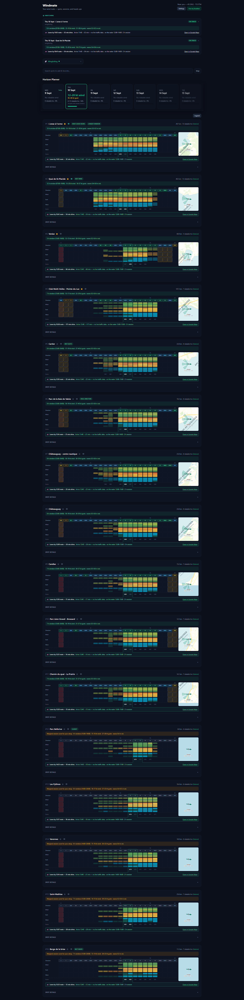
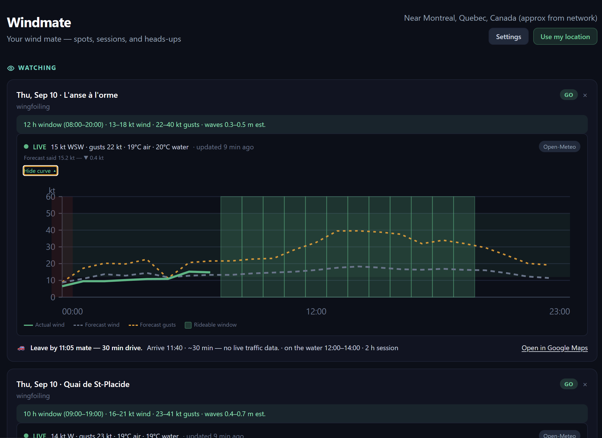

# Windmate

Your wind mate — spot forecasts, session planning, and heads-ups for wingfoiling, kitesurfing, sailing, windsurfing, kitefoiling, and parawing.

Windmate helps you decide **where** and **when** to get on the water — and whether a spot is actually **worth the drive**. It combines community spots from [iGetwind](https://igetwind.com/), multi-model wind forecasts, rideability rules (wind, gusts, rain, temperature), live observations, and a dark dashboard tuned for quick session decisions.

Beyond wind and waves, the product roadmap covers **local ground truth**: social posts from the spot, live cams, water hazards (algae, debris, launch flooding), parking (free vs paid, open on session day), and seasonal access (flooded roads, closed lots) — with **lower ranking and mate-tone explanations** when a spot should be avoided.

<p align="center">
  <a href="assets/windmate-screenshot.png">
    
  </a>
</p>

<p align="center">
  <a href="assets/session-day.png">
    
  </a>
</p>

<p align="center"><em>Click the screenshot for the full-size view.</em></p>

## What it does

- **Find spots near you** — browser GPS (or manual coordinates), searchable spot list, customizable radius
- **Horizon Planner** — 7-day outlook; tap a day to rank spots for that session
- **Rideability Matrix** — hour-by-hour blocks with Beaufort wind/gust colors and wave bands (flat / small / big)
- **Live observations** — station or model “actual” wind vs forecast, with an expandable day curve
- **Mate's picks** — top spots for today using your ranking preferences
- **Favorites** — star spots to keep them at the top (even outside your radius)
- **Session warnings** — storm and wind-fade “wrap up by …” hints after rideable windows
- **Email alerts** — optional cron job when rideable windows appear (SMTP configurable)
- **Settings** — sport, wind/gust/temp thresholds, search radius, drag-to-reorder ranking criteria (auto-saved)

Implementation status vs design specs: [`docs/superpowers/specs/STATUS.md`](docs/superpowers/specs/STATUS.md).

## Tech stack

- **Node.js 20+**, Express, SQLite (`better-sqlite3`)
- **Frontend:** vanilla JS + Tailwind (CDN), no build step
- **Forecast:** Open-Meteo + iGetwind models (HRDPS/LAM, HRRR, GFS)
- **Scheduler:** `node-cron` for email alerts

## Prerequisites

- [Node.js](https://nodejs.org/) **20 or later**
- npm
- Git (optional, for clone)

On Windows, native deps for `better-sqlite3` may require [Visual Studio Build Tools](https://visualstudio.microsoft.com/visual-cpp-build-tools/) if `npm install` fails.

## Setup

```bash
git clone https://github.com/smorel/windmate.git
cd windmate

npm install

cp .env.example .env   # Windows: copy .env.example .env
```

Edit `.env` if needed (see [Configuration](#configuration)). At minimum, first run works with defaults; email alerts log to the console until SMTP is set.

### First run (spot sync)

By default, startup syncs community spots from iGetwind (~500 spots). That can take a minute on first launch.

To skip sync during development:

```env
IGETWIND_SYNC_SPOTS=false
```

To limit sync to a region (faster):

```env
IGETWIND_SYNC_RADIUS_KM=150
IGETWIND_SYNC_CENTER_LAT=45.5017
IGETWIND_SYNC_CENTER_LNG=-73.5673
```

## Run locally

```bash
npm start
```

Open **[http://localhost:3000](http://localhost:3000)**.

Development with auto-restart on file changes:

```bash
npm run dev
```

### Browser location

Precise GPS needs **HTTPS or localhost**. On `http://localhost:3000` it works; on a plain HTTP LAN IP, use **Settings → manual coordinates** or the IP-based rough location fallback.

### Data directory

SQLite and caches live under `data/` (created automatically, gitignored):

- `data/windwatch.db` — spots, preferences, caches

Delete `data/windwatch.db` to reset preferences and caches (spots re-sync on next start if enabled).

## Configuration

Copy from [`.env.example`](.env.example). Common variables:

| Variable | Description | Default |
|----------|-------------|---------|
| `PORT` | HTTP port | `3000` |
| `DEFAULT_RADIUS_KM` | Default API radius if not overridden by user prefs | `50` |
| `CRON_SCHEDULE` | Rideability email cron (cron syntax) | `0 */3 * * *` |
| `WEATHER_PROVIDER` | `mixed`, `open-meteo`, or single model | `mixed` |
| `IGETWIND_SYNC_SPOTS` | Sync spots on startup | `true` |
| `IGETWIND_SYNC_RADIUS_KM` | `0` = worldwide; e.g. `150` = radius around center | `0` |
| `OBSERVATION_CACHE_TTL_MS` | Live obs cache TTL | `300000` (5 min) |
| `SMTP_*` / `ALERT_EMAIL_*` | Email alerts (optional) | — |
| `WINDY_API_KEY` | Optional Windy observation fallback | — |

User-facing **search radius** is stored in the app (Settings) and sent with API requests; it overrides the default for the dashboard.

Without SMTP, alerts are **logged only** — no email is sent.

## API (overview)

| Method | Endpoint | Description |
|--------|----------|-------------|
| GET | `/api/health` | Health check |
| GET | `/api/spots?lat=&lng=&radius=` | Nearby spots by distance |
| GET | `/api/spots/search?q=&lat=&lng=` | Search spots by name |
| GET | `/api/forecast/:spotId` | Cached forecast for one spot |
| GET | `/api/rideability?lat=&lng=&radius=&limit=` | Matrix data + preferences |
| GET | `/api/observations?lat=&lng=&radius=` | Live wind + forecast comparison |
| GET | `/api/preferences` | User preferences |
| PUT | `/api/preferences` | Update preferences |
| POST | `/api/igetwind/sync` | Re-import spots from iGetwind |

## Project layout

```
src/
  server.js           # Express entry
  db.js               # SQLite schema + migrations
  routes/             # REST handlers
  services/           # Forecast, rideability, observations, iGetwind
  cron/               # Email alert scheduler
public/
  index.html          # Dashboard SPA
  js/                 # app.js, sessionRank, observations, …
  css/
docs/superpowers/specs/   # Design specs + STATUS.md
```

## Roadmap

**Shipped focus so far:** wind/wave windows, live observations, client-side session ranking.

**Planned next** (see [`docs/superpowers/specs/STATUS.md`](docs/superpowers/specs/STATUS.md)):

1. Go/no-go mismatch pill (forecast vs live)
2. Session watchlist (spot + date)
3. Offshore / water quality / water level in ranking
4. **Spot local intel** — social feed, live cams, parking & access, water hazards; rank lower when a spot is a bad bet ([spec](docs/superpowers/specs/2026-09-09-spot-local-intel-design.md))
5. **Departure planner** — leave-by time from home using min consecutive hours, your **ranking criteria order** (not raw wind), and Google Maps drive duration ([spec](docs/superpowers/specs/2026-09-09-departure-planner-design.md))

Design specs live under `docs/superpowers/specs/`:

| Spec | Topic |
|------|--------|
| [windwatch-design](docs/superpowers/specs/2026-09-08-windwatch-design.md) | MVP + core pipeline |
| [realtime-wind-design](docs/superpowers/specs/2026-09-08-realtime-wind-design.md) | Live wind vs forecast |
| [session-ranking-design](docs/superpowers/specs/2026-09-08-session-ranking-design.md) | Composite spot score |
| [session-watchlist-design](docs/superpowers/specs/2026-09-08-session-watchlist-design.md) | Planned sessions + cams |
| [spot-local-intel-design](docs/superpowers/specs/2026-09-09-spot-local-intel-design.md) | Social, parking, access, water |
| [departure-planner-design](docs/superpowers/specs/2026-09-09-departure-planner-design.md) | When to leave home for the best window |

## License

Private / all rights reserved unless otherwise noted by the repository owner.
