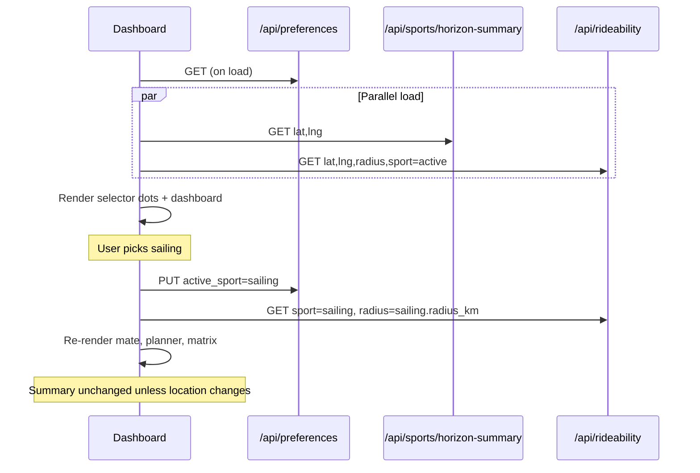

# Dashboard Sport Selector — Design Spec

**Date:** 2026-09-09  
**Status:** Draft  
**Parent:** [Windmate Design Spec](./2026-09-08-windwatch-design.md)  
**Related:** [Per-Sport Preferences & Horizon Alerts](./2026-09-09-per-sport-preferences-alerts-design.md), [Session Spot Ranking](./2026-09-08-session-ranking-design.md)

## Goal

Once [per-sport profiles](./2026-09-09-per-sport-preferences-alerts-design.md) ship, the dashboard needs a **primary sport switcher** so users can flip between sports without opening Settings. Each option shows a **horizon status dot** — at a glance, whether that sport has a qualifying session opportunity in its alert horizon.

Selecting a sport applies **that sport's profile** to the whole dashboard: Mate's picks, Horizon Planner, Rideability Matrix ranking, wind gates, radius, and accent colour.

## User story

> "I only wing and kite — I turned off sailing, windsurf, kitefoil, and parawing in Settings. My dashboard dropdown just shows those two. On Monday wing has a green dot, kite is gray. I stay on wing. Saturday I switch to kite — matrix re-ranks with my kite thresholds and radius."

> "I wing weekdays and sail weekends (both enabled). Monday — wing green, sailing gray. Saturday I switch to sailing — matrix re-ranks for wind and waves, radius jumps to 80 km."

## Problem with today

Sport lives only in **Settings**. Changing it **overwrites** the single `user_preferences` row. There is no way to see which sports look promising this week without manually switching and re-reading the planner.

## Scope

### In scope (v1)

- **Dashboard dropdown** below spot search, above Mate's picks
- **Status dot per sport** — green if ≥1 qualifying horizon day; gray otherwise
- **`GET /api/sports/horizon-summary`** — server-computed dots for all enabled sports (single source of truth with horizon alerts)
- **Active sport switch** — `PUT /api/preferences { active_sport }` + rideability refetch with `?sport=`
- **Full dashboard refresh** on switch (mate's pick, planner, matrix)
- **Accessibility** — keyboard, `aria-expanded`, screen-reader labels for dot state

### Out of scope

- Next-day label or day count in dropdown (v2 polish — see [Open questions](#open-questions))
- Per-sport favorites in switcher
- Showing disabled sports in dropdown (hidden; re-enable via **My sports** in Settings)
- Live-observation-based dots (forecast only — same as horizon alerts)

## Dependencies

Requires [Per-Sport Preferences v1](./2026-09-09-per-sport-preferences-alerts-design.md):

- `sport_profiles` table
- `active_sport` on `user_preferences`
- `GET /api/rideability?sport=`
- Per-sport settings tabs (sport removed from global rideability form)

## UI design

### Placement

```
[ Spot search bar                                    ]
[ 🪽 Wingfoiling  ● ]  ▾          ← sport selector (new)
[ Mate's picks today                                 ]
[ Horizon Planner                                    ]
[ Rideability Matrix                                 ]
```

Replaces the header pill toggle described in the per-sport spec. Settings tooltip copy: *"Using your wingfoil settings — switch sport on the dashboard."*

### Control behaviour

| State | Content |
|---|---|
| **Closed** | Active sport display name + sport accent (`SPORT_COLORS`) + its horizon dot |
| **Open** | List of **enabled** sports only, each row: name + dot, sorted A→Z by display name |
| **Selected row** | Left border or tint in sport colour |

**Interaction:**

- Click/tap row → set `active_sport`, close menu, refresh dashboard
- Click outside / `Escape` → close without change
- Sport change does **not** open Settings

### Horizon status dot

| Dot | Meaning |
|---|---|
| **Green** (`emerald-400`) | At least one qualifying session day in this sport's alert horizon |
| **Gray** (`slate-600`) | No qualifying days in horizon |

Dot only — no day name or count in v1.

**Screen reader:** `aria-label` on each row, e.g. *"Wingfoiling — session possible this week"* / *"Sailing — no sessions on horizon"*.

### Visual reference

Only **enabled** sports appear (e.g. user practices wing + kite only):

```
┌─────────────────────────────┐
│ 🪽 Wingfoiling           ● │ ▾
└─────────────────────────────┘
        ↓ open
┌─────────────────────────────┐
│ Wingfoiling              ● │  ← green
│ Kitesurfing              ○ │  ← gray — no qualifying days
└─────────────────────────────┘
```

Sailing, windsurf, etc. are absent — disabled in Settings → My sports.

## Horizon qualification logic

Shared with [alert qualification](./2026-09-09-per-sport-preferences-alerts-design.md#alert-qualification-logic) and implemented once in `src/services/alertQualification.js` (or `horizonQualification.js`).

For each **enabled** `sport_profile`, `hasOpportunity` is `true` when **any** `session_date` qualifies:

| Check | Source |
|---|---|
| Horizon range | `today` … `today + alert_schedule.horizon_days` (default 7) |
| Eligible weekday | `session_date`'s weekday ∈ `alert_schedule.days_of_week` |
| Today inclusion | If `today_alerts: false`, skip today |
| Spots in range | ≥1 spot within `radius_km` (favorites beyond radius included — same as matrix) |
| Min window | Best consensus consecutive rideable run ≥ `min_rideable_window_hours` |
| Min quality | Top spot `sessionScore` for that day ≥ `alert_schedule.min_session_score` |

Rideability uses **forecast** (consensus models), not live observations. Ranking factors and `rank_criteria_order` come from **that sport's profile**.

**Example:** Sailing with `days_of_week: [0, 6]` — Thursday wind does not turn the dot green; Saturday candidate does.

## API

### `GET /api/sports/horizon-summary`

Returns horizon dot state for all enabled sports. Called on dashboard load and after location/radius changes (not on every sport switch — inactive sports' dots are stable until forecast or prefs change).

| Query | Required | Notes |
|---|---|---|
| `lat` | yes | User origin |
| `lng` | yes | User origin |

**Response:**

```json
{
  "active_sport": "wingfoiling",
  "sports": [
    {
      "sport": "wingfoiling",
      "display_name": "Wingfoiling",
      "color": "#10b981",
      "enabled": true,
      "has_opportunity": true
    },
    {
      "sport": "sailing",
      "display_name": "Sailing",
      "color": "#14b8a6",
      "enabled": true,
      "has_opportunity": false
    }
  ],
  "computed_at": 1725897600000
}
```

- Only `enabled: 1` profiles appear in `sports[]`.
- Order: alphabetical by `display_name`.
- `has_opportunity` drives the dot (green / gray).
- `color` from `SPORT_COLORS` — client need not duplicate map.

**Errors:** `400` if `lat`/`lng` missing; `500` on forecast failure (dashboard may show gray dots + retry).

### Existing endpoints (unchanged contract)

| Method | Path | Sport selector use |
|---|---|---|
| GET | `/api/preferences` | Load `active_sport` + all profiles on init |
| PUT | `/api/preferences` | `{ "active_sport": "sailing" }` on switch |
| GET | `/api/rideability?lat=&lng=&radius=&sport=` | Full dashboard payload for selected sport |

`radius` on rideability should default to the **active sport profile's** `radius_km` when omitted.

## Data flow



### Refresh triggers

| Event | Summary | Rideability | UI |
|---|---|---|---|
| Page load / location change | refetch | refetch | full render |
| Sport switch | no | refetch (`?sport=`) | full render |
| Settings save (thresholds on any sport) | refetch | refetch if active sport edited | dots + dashboard |
| Cron / cache | N/A | N/A | user refresh only |

Preserve `selectedDayDate` across sport switch when that date still exists in the new payload; otherwise reset to forecast today.

### Loading UX

- Sport switch: optional matrix/planner shimmer; dropdown stays interactive
- Summary slow/failed: show gray dots for all sports; log error; retry on next dashboard refresh

## Client modules (planned)

| File | Responsibility |
|---|---|
| `public/js/sportSelector.js` | Dropdown UI, open/close, keyboard, dot render |
| `public/js/app.js` | Orchestrate load, switch handler, `refreshDashboard` |
| `src/routes/sports.js` | `GET /api/sports/horizon-summary` |
| `src/services/alertQualification.js` | `hasHorizonOpportunity(profile, spots, forecasts)` — shared with cron |

Remove global **Sport** `<select>` from settings form; sport editing moves to per-sport tabs only.

## Settings interaction — My sports

Users enable only the sports they practice. See [per-sport spec — My sports](./2026-09-09-per-sport-preferences-alerts-design.md#settings--my-sports--per-sport-tabs).

| Layer | Enabled sports | Disabled sports |
|---|---|---|
| **Dashboard dropdown** | Listed with horizon dots | Hidden |
| **Settings tabs** | Full rideability / ranking / alerts | Hidden (toggle back on in My sports) |
| **Horizon summary API** | Computed | Omitted from response |
| **Alert cron** | Scanned | Skipped |
| **DB profile row** | Active | Retained — re-enable restores saved thresholds |

On toggle off: if that sport was `active_sport`, switch to first remaining enabled sport (alphabetical) and refresh dashboard. Cannot disable the last sport.

**Per-sport tabs** (enabled only) edit thresholds, radius, alert schedule. Changing alert `days_of_week` or `min_session_score` updates summary dots on next summary refetch.

**Single enabled sport:** hide dropdown chevron; show sport label + dot only (no menu). User re-enables more sports in Settings when needed.

## Testing checklist

- [ ] Only enabled sports in dropdown; disabled sports hidden entirely
- [ ] My sports toggle off removes sport from dropdown immediately; toggle on adds it back
- [ ] Cannot disable last enabled sport (validation error + UI block)
- [ ] Single enabled sport — label only, no chevron/dropdown
- [ ] Green dot when wing `any day` + qualifying Thursday exists; gray when none
- [ ] Sailing `weekends only` — gray Mon–Fri with good wind; green when Sat qualifies
- [ ] Switch sport updates matrix rank order, wind gates, radius, sport colour, mate's pick
- [ ] `PUT active_sport` persists; reload restores selection
- [ ] Summary and horizon alert cron use same qualification function — same sport+day → same result
- [ ] Location change refetches summary with new spot set
- [ ] Keyboard: arrow keys navigate list, Enter selects, Escape closes
- [ ] Active sport disabled in settings → fallback sport selected and dashboard loads

## Phasing

| Phase | Deliverable |
|---|---|
| **v1** | Dropdown + summary endpoint + active sport refresh (this spec) |
| **v2** | Dot + next eligible day label (`Thu`) in dropdown rows |
| **v3** | Invalidate summary via short TTL cache; optional WebSocket/poll when cron runs |

## Open questions

1. **Summary cache TTL** — recompute every request vs 15 min server cache keyed by `(lat, lng, profiles fingerprint)`?
2. **v2 glance text** — next day name vs rideable hour count when user wants more than a dot?
3. ~~**Single enabled sport**~~ — resolved: label + dot only, no chevron when count = 1
